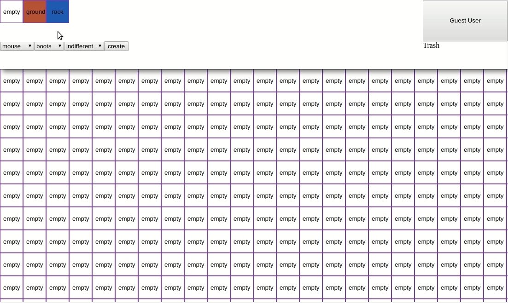

# Tile Editor in ReasonML

Prototype of a tile editor in ReasonML/React.  
Tiles can be updated and elements added and positioned absolutely on the tileset.

# Run

`npm install && npm run start`

# Demo

